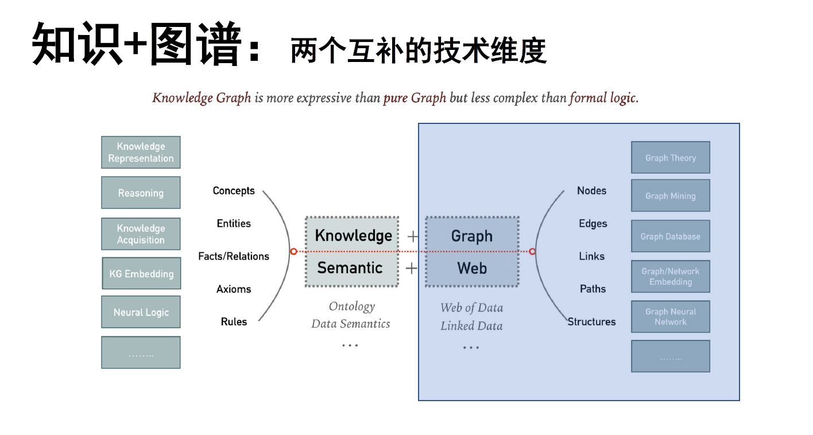

# 图的基本知识
## 知识与图之间的联系

## 图数据例子
* 生物学网络：人类疾病网络
* 分子结构图
* 交通网络图
* 社交网络
* 万维网

## 图的概念
### 节点的度
* 无向图中节点的度：与该节点相连的边的数量。
* 有向图中节点的度分为入度和出度，分别为从其他节点指向该节点的边的数量和以该节点出发指向其他节点的边的数量。

### 邻接矩阵
可用来唯一标识一个图。

### bipartite graph

### 最短路径
### 图的直径与平均路径长度

### 欧拉路径和汉密尔顿路径
## 图的理论
### 六度理论
世界上任意两个人之间最多经过六个相关的人就可以建立联系。

### 无尺度网络
很多复杂的系统拥有共同的重要特性：大部分节点只有少数几个连接，而某些节点却拥有与其他节点的大量连接。
### 随机网络模型

## 总结
* 图能够建模很多客观世界的复杂问题，图技术在研究疾病交互网络、交通网络、社交网络等很多领域有重要的应用
* 常见的图和网络模型有无尺度网络和随机网络等，它们分别被用来建模不同类型的复杂问题
* 知识图谱可以看作是图的一种应用，但与普通的图还是有非常大的区别。图的一些理论和算法多可以用来处理和分析知识图谱数据